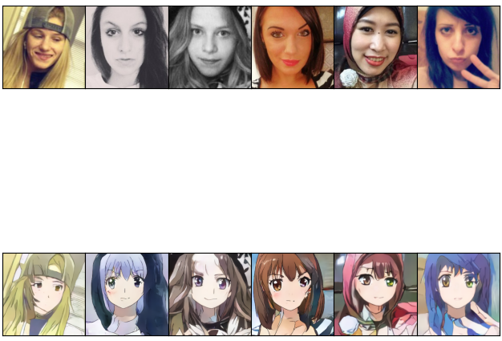
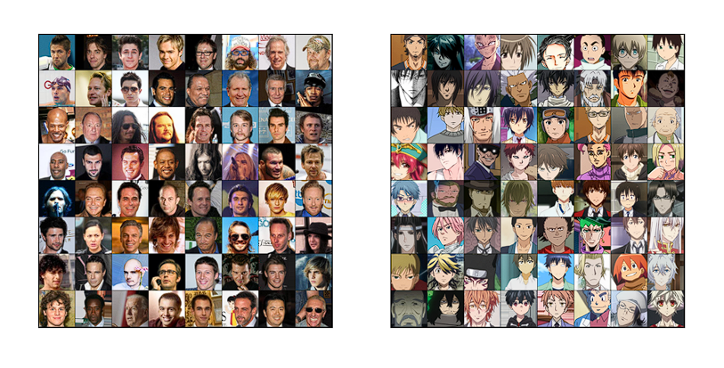
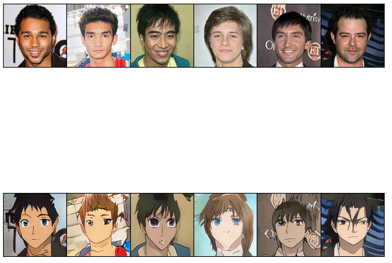

# Overview

This package provides CycleGAN and generator implementations to transform `both female and male` selfies to anime.

Many projects were made to train CycleGAN based models to transform selfie to anime. Most of the works are based on selfie2anime [dataset][selfie2anime] with high quality results.
But there is one problem with that dataset. Both anime characters and selfies are females. And CycleGAN projects transforming male selfies to anime male characters either are not found.

So there are two purposes of this project:
- implement CycleGAN architecture with further training of it on selfie2anime dataset
- trying to collect custom dataset male2anime and train implemented CycleGAN on this dataset for male photo to anime character.


# Training details and results

### Selfie2anime

CycleGAN was trained without `gradient penalty` and `identity mapping loss` for 190 epoches (75 epoches with 0.0002 lr, 25 with 0.0001 lr, 90 epoches with linear decay lr)

With the following results:

<p align="center">
  
</p>

### Male2anime

Custom dataset wad collected. 3050 male anime characters were webscrapped [from anime-planet][anime-planet], 4x upscaled by [waifu2x](https://github.com/yu45020/Waifu2x), faces were detected by [lbpcascade_animeface](https://github.com/nagadomi/lbpcascade_animeface), then resize and center cropped by 256. Selfies were taked from Celeba dataset. Below dataset images are presented.

<p align="center">
  
</p>


The model was trained for 120 epoches (72 epoches lr 0.0002, 5o epoches lr 0.0001) without `gradient penalty` and `identity mapping loss`.
One of the best results are below:

<p align="center">
  
</p>

# Usage

Download repository and change to current directory

Download model [weights](https://drive.google.com/drive/folders/1plKb46Rxx5-ZTOdyPK0Ean2l2kmYI0ez) to weight subfolders

Run

```
python script --src path/to/source/image.png --dest path/to/output/image/name.png
```
`Note`: by default it transforms to female anime. If you want to transform male, `--male` option must be added to above code

```
python script.py --src path/to/source/image/name.png --dest path/to/output/image/name.png --male
```

If you want to train model, use:

```
python train.py --PATH_A path/to/trainA/image/folder --PATH_B path/to/trainB/image/folder
```
`Note`: See a lot more options in configs.config_train.py


[selfie2anime]: https://www.kaggle.com/datasets/arnaud58/selfie2anime
[anime-planet]: https://www.anime-planet.com